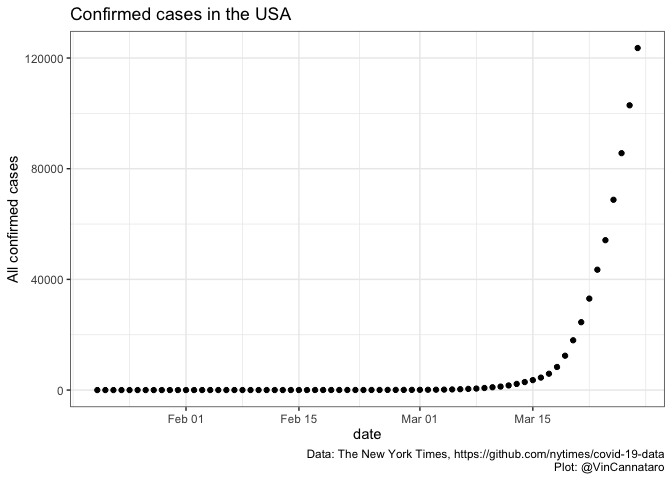
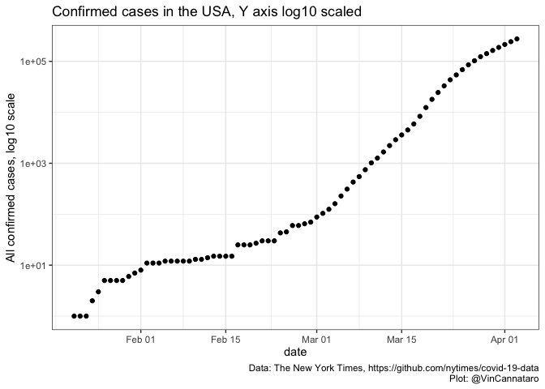

COVID19 data exploration
================
Vincent L. Cannataro
last update 2020-March-21

Data obtained from curated Johns Hopkins University Center for Systems
Science and Engineering database here:
<https://github.com/CSSEGISandData/COVID-19.git>

# Current USA confirmed cases

It looks like the total number of confirmed cases in the USA is
currently growing
exponentially.

<!-- --><!-- -->

Indeed, if we pull out the data from 2020-03-01 until the current date,
and fit a linear model to the log10(y) ~ x,

``` r
start_date
```

    ## [1] "2020-03-01"

``` r
fit_lm_exp <- lm(formula = log10(all_cases) ~ Date, 
                 data = subset(US_data,Date>start_date))

# summary(fit_lm_exp)$r.squared # removed r.squared because 
# it is not a correct statistic on this time series data 
# https://twitter.com/vsbuffalo/status/1239233074203746304 
```

<!-- We find an $R^2$ value of 0.997 -->

# Fitting into the future, assuming\* exponential growth continues

\* of course, exponential growth never continues indefinitely in
population models. Eventually, you will either run out of new
susceptible people to infect. Or, we can intervene in disease spread,
and deviate from this continued growth.

But, let’s assume exponential growth continues. What would happen to the
number of confirmed cases over time?

We can use our fit to the recent data generated above to predict into
the future.

``` r
end_date
```

    ## [1] "2020-04-12"

``` r
# fitting into the future 
future_predictions <- data.frame(Date = seq(start_date,end_date,by = "1 day"))

future_predictions$log10_count <- predict(fit_lm_exp,newdata = future_predictions)
```

<!-- -->

Keep in mind, that the axis above is on a log10 scale, meaning that
\(6\) on the axis is really \(1000000\)

*Let’s do everything we can do deviate from this
fit\!*

# By State

<!-- --><!-- -->

## Table of confirmed cases in the USA:

The total number of confirmed cases in the USA by date:

| Country/Region | Date       | all\_cases |
| :------------- | :--------- | ---------: |
| US             | 2020-01-22 |          1 |
| US             | 2020-01-23 |          1 |
| US             | 2020-01-24 |          2 |
| US             | 2020-01-25 |          2 |
| US             | 2020-01-26 |          5 |
| US             | 2020-01-27 |          5 |
| US             | 2020-01-28 |          5 |
| US             | 2020-01-29 |          5 |
| US             | 2020-01-30 |          5 |
| US             | 2020-01-31 |          7 |
| US             | 2020-02-01 |          8 |
| US             | 2020-02-02 |          8 |
| US             | 2020-02-03 |         11 |
| US             | 2020-02-04 |         11 |
| US             | 2020-02-05 |         11 |
| US             | 2020-02-06 |         11 |
| US             | 2020-02-07 |         11 |
| US             | 2020-02-08 |         11 |
| US             | 2020-02-09 |         11 |
| US             | 2020-02-10 |         11 |
| US             | 2020-02-11 |         12 |
| US             | 2020-02-12 |         12 |
| US             | 2020-02-13 |         13 |
| US             | 2020-02-14 |         13 |
| US             | 2020-02-15 |         13 |
| US             | 2020-02-16 |         13 |
| US             | 2020-02-17 |         13 |
| US             | 2020-02-18 |         13 |
| US             | 2020-02-19 |         13 |
| US             | 2020-02-20 |         13 |
| US             | 2020-02-21 |         15 |
| US             | 2020-02-22 |         15 |
| US             | 2020-02-23 |         15 |
| US             | 2020-02-24 |         51 |
| US             | 2020-02-25 |         51 |
| US             | 2020-02-26 |         57 |
| US             | 2020-02-27 |         58 |
| US             | 2020-02-28 |         60 |
| US             | 2020-02-29 |         68 |
| US             | 2020-03-01 |         74 |
| US             | 2020-03-02 |         98 |
| US             | 2020-03-03 |        118 |
| US             | 2020-03-04 |        149 |
| US             | 2020-03-05 |        217 |
| US             | 2020-03-06 |        262 |
| US             | 2020-03-07 |        402 |
| US             | 2020-03-08 |        518 |
| US             | 2020-03-09 |        583 |
| US             | 2020-03-10 |        959 |
| US             | 2020-03-11 |       1281 |
| US             | 2020-03-12 |       1663 |
| US             | 2020-03-13 |       2179 |
| US             | 2020-03-14 |       2727 |
| US             | 2020-03-15 |       3499 |
| US             | 2020-03-16 |       4632 |
| US             | 2020-03-17 |       6421 |
| US             | 2020-03-18 |       7783 |
| US             | 2020-03-19 |      13677 |
| US             | 2020-03-20 |      19100 |
